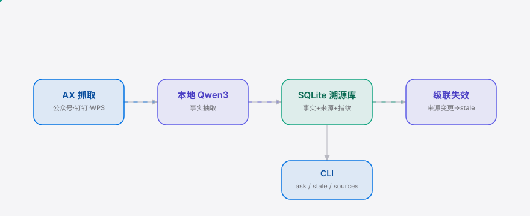

<div align="right"><sub><a href="./README.en.md">English</a>&nbsp;&nbsp;⇄&nbsp;&nbsp;<b>简体中文</b></sub></div>

<picture>
  <source media="(prefers-color-scheme: dark)" srcset="./assets/hero-dark.svg">
  <source media="(prefers-color-scheme: light)" srcset="./assets/hero-light.svg">
  
</picture>

<p align="center"><sub>本地 Qwen 渲染的环境记忆——给每条读到的事实打上来源指纹，来源一改即级联失效。</sub></p>

<p align="center">
  <a href="./LICENSE"></a>
  
  
  
</p>

> **记不住在哪看到那个数字——溯记替你记下它来自哪篇公众号、哪份钉钉文档，来源一改即标失效。**

<h2> 架构</h2>

<picture>
  <source media="(prefers-color-scheme: dark)" srcset="./assets/atlas-dark.svg">
  <source media="(prefers-color-scheme: light)" srcset="./assets/atlas-light.svg">
  
</picture>

单进程菜单栏 app + CLI，无微服务、无云。菜单栏经 macOS Accessibility API 读取聚焦窗口的**纯文本**（无截图、无 OCR），本地 Qwen3 经 Ollama 抽取离散事实，每条带来源指纹入 SQLite；CLI 负责 `ask`（溯源查询）/ `stale`（级联失效）/ `sources`（来源列表）。

<h2> 为什么存在</h2>

中国 prosumer 每天跨微信公众号、浏览器、钉钉文档、WPS 阅读，把数字、规格、消息随手复制进备忘录——两周后想不起它来自哪篇公众号，更糟的是那篇文章被悄悄改了，你的笔记还在引用旧数字。溯记给每条抓到的事实打上来源应用 + 文档指纹，当来源文档变更时，派生自旧内容的事实被**级联标记失效**并附新旧 diff。

`ambient-context`（Show HN 62 赞）已验证「无截图 AX 抓取」形态被需要，但它把文本送往云端、存扁平 daily markdown、无 per-fact provenance、来源改了也不知情。溯记把同一形态装进中国用户的设备里——本地 Qwen 渲染、数据不出 Mac，并补上来源级联失效这块它缺的。

| | ambient-context | 溯记 SuJi |
|---|:---:|:---:|
| 无截图 AX 抓取 | ✓ | ✓ |
| 数据不出设备 | ✗（上云） | ✓（本地 Qwen3） |
| per-fact 来源指纹 | ✗（扁平 daily md） | ✓ |
| 来源变更级联失效 | ✗ | ✓ |
| 中文应用来源（公众号/钉钉/WPS） | — | ✓（v0.1 文件来源稳定） |

<h2> 安装与快速开始</h2>

```bash
# 1. 装一次本地 Qwen3（一次性，后续复用）
ollama pull qwen3

# 2. 安装溯记（macOS 菜单栏依赖在 [macos] extra；CLI 在任意平台可用）
pip install -e ".[macos]"

# 3. 授予「辅助功能」权限（系统设置 → 隐私与安全性 → 辅助功能），然后启动菜单栏
suji-bar          # 菜单栏点「开始记忆」即可抓取聚焦窗口文本
```

> 没有 Mac 或还没装 Ollama？CLI 的 `ask / stale / sources` 也能在任意平台跑起来试，见 [Demo](#demo)。

<details><summary>装好后第一次抓取</summary>

打开一篇公众号文章（或本地 WPS 文档），菜单栏点「开始记忆」→ 后台每几秒抓取聚焦窗口正文 → 本地 qwen3 抽事实入库。然后：

```bash
suji ask "Q3 营收"      # 返回事实 + 那篇公众号链接 + 抓取时间
suji sources            # 列出已记来源
```
</details>

<h2> 用法</h2>

```bash
# 溯源查询——记得在哪看到的，回溯到来源
suji ask "Q3 营收"
# 事实             来源应用        文档 / 链接           抓取时间        状态
# Q3 营收 4.2 亿   com.apple.Safari https://mp.weixin... 2026-08-31 07:34 有效
# 来源：https://mp.weixin.qq.com/s/abc

# 来源再校验并级联失效——公众号文章被编辑后
suji stale
# · https://mp.weixin.qq.com/s/abc 来源已变更 → 1 条事实标记失效
# Q3 营收 4.2 亿   来源：...abc   新旧来源 diff（4.2 亿 → 4.3 亿）

# 列出所有已记来源与有效/失效计数
suji sources
```

更多示例见 [`examples/seed_demo.py`](./examples/seed_demo.py)（用程序化 API 抓取本地文件来源 → 编辑 → `suji stale` 的完整 10 分钟路径）。

<h2> Demo</h2>

抓取一篇公众号文章事实 → `ask` 溯源 → 编辑文章 → `suji stale` 级联标记失效 + 新旧来源 diff：


（CI 用 [`docs/demo.tape`](./docs/demo.tape) 经 [vhs](https://github.com/charmbracelet/vhs) 渲染 [`assets/demo.gif`](./assets/demo.gif)；本地可 `vhs docs/demo.tape` 重渲染。）

<h2> 配置</h2>

| 环境变量 | 类型 | 默认 | 含义 |
|---|---|---|---|
| `SUJI_DB` | path | `~/.suji/suji.db` | SQLite 存储路径（测试 / demo 可覆盖） |
| `SUJI_NO_LLM` | `1`/unset | unset | 置 `1` 用规则兜底抽取，免 Ollama（测试 / CI / demo 用） |
| `SUJI_LLM_BASE_URL` | url | `http://localhost:11434/v1` | Ollama 的 OpenAI 兼容端点 |
| `SUJI_LLM_MODEL` | str | `qwen3` | 本地模型名 |

菜单栏抓取间隔在 [`suji/menu_bar.py`](./suji/menu_bar.py) 顶部 `_CAPTURE_INTERVAL`（默认 5 秒）。

<h2> 路线图</h2>

- [x] **m1 — 抓取 + 溯源**：菜单栏经 AX API 抓取聚焦窗口文本，本地 qwen3 抽离散事实，每条带来源指纹入 SQLite，`suji ask` 回溯来源
- [x] **m2 — 级联失效**：来源指纹再校验（URL 周期重抓 / 本地 WPS·钉钉缓存文件 watchdog），指纹不符即级联标 stale + 新旧来源 diff
- [ ] **m3 — 一键安装**：一键 Ollama 桥、10 分钟安装、扩展到微信/钉钉/WPS 全 app 深度文本解析（URL 来源的 AX 文本与 HTTP HTML 表示差异归一化）
- [ ] Windows / Linux 移植（AX API 是 macOS 特性；UI Automation 是对应路径）
- [ ] 团队共享 provenance + 合规审计导出（见 [付费](#付费)）

<h2> 付费</h2>

v0.1 全量免费开源、本地运行、无任何付费墙——这层不碰。但 commercial 受众不能裸 ship：私有化 / 信创部署的**团队同步 + 合规留痕**是变现路径，对应 SMB 投研 / 咨询团队（5–20 人，钉钉文档 / 飞书重度 org）的两件 v0.1 没有的东西：

- **私有化部署**——装进他们的钉钉 / 飞书 tenant（Docker image + SQLite→Postgres）
- **团队事实同步**——per-source provenance 跨人共享
- **合规审计导出**——`suji stale` 的来源 diff 导 PDF，满足金融 / 咨询「来源可追溯」硬留痕

价格点（educated guess）：团队 plan **¥499/seat/年**；信创私有化站点 **¥20k–50k/年/站点**。账单走微信支付 / 对公转账（无 Stripe CN），海外走 Lemon Squeezy。v0.1 的免费试用正是付费 segment 的种子——付费需求在免费试用里被验证，付费墙落在 v0.2+，不进 v0.1 范围。

<h2> 许可与贡献</h2>

MIT，详见 [LICENSE](./LICENSE)。提 issue / PR：`github.com/SuperMarioYL/suji/issues`。

<p align="center"><sub><a href="./LICENSE">MIT</a> © 2026 SuperMarioYL</sub></p>
