[English](README.en.md) | **简体中文**

<picture>
  <source media="(max-width: 640px) and (prefers-color-scheme: dark)" srcset="assets/presentation/hero-mobile-dark.svg">
  <source media="(max-width: 640px)" srcset="assets/presentation/hero-mobile-light.svg">
  <source media="(prefers-color-scheme: dark)" srcset="assets/presentation/hero-dark.svg">
  
</picture>

**SuJi 将抽取的事实、来源地址和捕获时的内容指纹保存在 SQLite，提供关键词回查，并在重新校验发现来源变化时标记旧事实失效。**

`Python 3.12+ · optional macOS capture` · [MIT](LICENSE) · [GitHub](https://github.com/SuperMarioYL/suji) · [网站](https://suji.lei6393.com)

## 为什么需要它

笔记里的数字可能还在，出处却已被修改。事实和来源放在一起，复核时就能看到当时来自哪个文件或页面，以及后来哪些内容发生变化。fresh/stale 是来源版本状态，不表示陈述已经被验证为真或假。

<picture>
  <source media="(max-width: 640px) and (prefers-color-scheme: dark)" srcset="assets/presentation/process-mobile-dark.svg">
  <source media="(max-width: 640px)" srcset="assets/presentation/process-mobile-light.svg">
  <source media="(prefers-color-scheme: dark)" srcset="assets/presentation/process-dark.svg">
  
</picture>

## 架构

Capturer 提供文本与来源标签，FactExtractor 提取陈述，ingest_capture 写入来源与事实表。provenance 规范化内容后计算 SHA-256；Cascade 用文件、URL 或 doc_id fetcher 重新读取，再将旧指纹事实标为 stale 并保存 diff。macOS 菜单栏是可选的 Accessibility 捕获入口，CLI 可以无界面使用。

<picture>
  <source media="(max-width: 640px) and (prefers-color-scheme: dark)" srcset="assets/presentation/architecture-mobile-dark.svg">
  <source media="(max-width: 640px)" srcset="assets/presentation/architecture-mobile-light.svg">
  <source media="(prefers-color-scheme: dark)" srcset="assets/presentation/architecture-dark.svg">
  
</picture>

## 安装

需要 Python 3.12+。基本示例只使用本地文件、规则抽取和 SQLite，不需要 Mac、Ollama 或辅助功能权限。

```bash
git clone https://github.com/SuperMarioYL/suji.git
cd suji
python3 -m venv .venv
source .venv/bin/activate
python -m pip install -e .
```

## 快速开始

```bash
python examples/presentation_demo.py
```

构造文本包含“12 个任务”和“版本号是 1.0”两条事实。编辑任务数为 15 后，真实 FileFetcher 重读来源，Cascade 标记两条旧事实 stale，并保留含 12/15 的 diff。没有改动的版本号事实也失效，因为当前规则按整个来源指纹处理。

## 用法

```bash
# 对已有数据库查询和重新校验
export SUJI_DB="$PWD/suji.db"
suji ask "任务"
suji sources
suji stale
suji stale --list-only

# macOS 可选入口；需系统辅助功能授权
python -m pip install -e ".[macos]"
SUJI_NO_LLM=1 suji-bar
```

ask 是数据库关键词搜索，不是模型问答。stale 会重新获取已存来源，URL 类型可能联网；--list-only 只显示已经失效的事实。菜单栏默认处理聚焦窗口的可访问文本，不做截图 OCR。

## 能力与集成

| 来源或输出 | 当前边界 |
|---|---|
| 本地文本文件 | FileFetcher 读取 UTF-8 文本 |
| URL | HTTP 重新获取文本/HTML |
| 云文档 ID | 当前无法重新校验 |
| macOS AX | 可选权限和依赖下读取可访问文本 |
| SQLite / CLI | 事实、来源、指纹、diff 与搜索 |

<picture>
  <source media="(max-width: 640px) and (prefers-color-scheme: dark)" srcset="assets/presentation/integrations-mobile-dark.svg">
  <source media="(max-width: 640px)" srcset="assets/presentation/integrations-mobile-light.svg">
  <source media="(prefers-color-scheme: dark)" srcset="assets/presentation/integrations-dark.svg">
  
</picture>

## 配置与边界

| 环境变量 | 默认 |
|---|---|
| SUJI_DB | ~/.suji/suji.db |
| SUJI_NO_LLM | 1 显式使用规则 |
| SUJI_LLM_BASE_URL | http://localhost:11434/v1 |
| SUJI_LLM_MODEL | qwen3 |

模型默认地址是本地，但允许改为其他端点，程序不强制网络隔离。未设置 NO_LLM 时会选择模型抽取器；请求失败不会自动转换成一次成功规则抽取。

URL 重取的是原始 HTML，可能与 AX 纯文本不同；当前没有全面的正文归一化。来源无法读取时返回 unverifiable 并跳过，不会把旧 fresh 状态当作重新验证成功。文件 watcher 只覆盖启动时已有的文件来源，新来源可显式运行 stale。

## 运行记录

v0.1.0 的真实文件捕获接口、规则抽取、SQLite 与重新校验。没有读取屏幕、访问 URL 或调用模型；临时目录自动清理。

[输入、命令和完整输出](docs/demo-results.json)

[保留的历史终端录屏](assets/demo.gif) · [录制脚本](docs/demo.tape)。本轮示例以以上可重放记录为准。

## 路线图

- [x] 来源指纹、事实保存与关键词搜索。
- [x] 文件/URL 重新校验、失效标记和 diff。
- [x] 可选 macOS AX/菜单栏入口。
- [ ] 云文档 API、正文归一化和更完整来源适配。
- [ ] 跨平台捕获与团队同步。

当前没有已上线的团队托管或合规导出套餐。

## 开发与许可证

```bash
python -m pip install -e ".[dev]"
python -m pytest
```

本地接口示例在 examples/presentation_demo.py；来源与规则在 suji/provenance.py 和 suji/cascade.py。

[MIT](LICENSE) · [Issues](https://github.com/SuperMarioYL/suji/issues)
